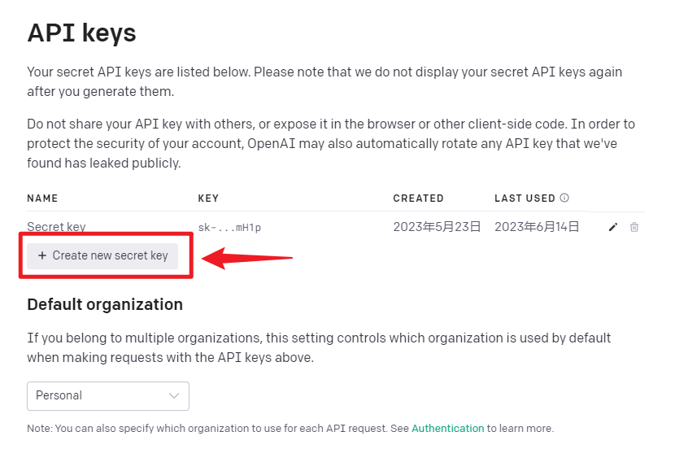
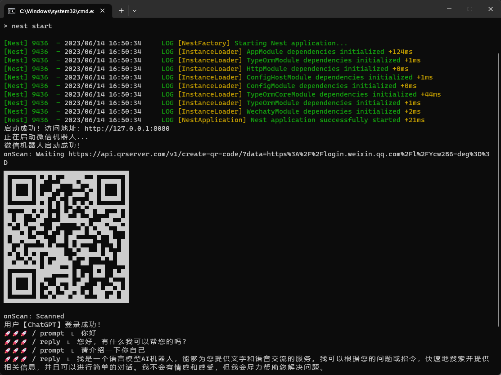

# WeChat AI Bot

一个 基于 `nestjs` + `openai` + `wechaty` 的微信机器人

## 1、检查开发环境

检查好自己的开发环境，确保已经安装了 `nodejs` , 版本需要满足 Node.js >= v18.0 ，版本太低会导致运行报错,最好使用 LTS 版本。

## 2、获取 openai 的 apikey

先获取自己的 `api key`，地址戳这里 👉🏻 ：[创建你的 api key](https://platform.openai.com/account/api-keys)


## 3、创建数据库

创建数据库 sql文件在项目根路径 `wechat-ai-bot.sql`，直接运行sql即可

## 4、修改配置

然后在项目`src/configs/index.ts`文件中修改相关配置，内容如下：

```
export default {
  # MySQL数据库配置
  MYSQL_HOST: '',
  MYSQL_PORT: 3306,
  MYSQL_USERNAME: '',
  MYSQL_PASSWORD: '',
  MYSQL_DATABASE: '',
  
  # OPENAI相关配置
  # OPENAI的APIKEY
  OPENAI_API_KEY: '',
  # OpenAI接口代理地址
  OPENAI_PROXY_URL: '',
  
  # 微信相关配置
  # 自动添加好友打招呼（空数组为允许所有）
  WECHAT_FRIENDSHIP_KEYS: ['ChatGPT'],
  # 防撤回群聊名称（空数组为所有群聊防撤回）
  WECHAT_PREVENT_RECALL_NAMES: ['ChatGPT测试群'],
  # 内置聊天关键词（在聊天开头输入相关指令即可触发）修改需谨慎！！！
  WECHAT_CHAT_COMMAND: {
    # 系统指令，可指定机器人扮演角色
    SYSTEM: '/system',
    # 生成图片指令
    IMAGE: '/image'
  }
}
```

## 5、运行服务

```
# 安装依赖
pnpm install
# 启动服务
pnpm start
```

然后就可以扫码登录了，然后根据你的需求，自己修改相关逻辑文件。


